<!--
  This is your PROFILE README. It goes in a repo named exactly after your
  username (e.g. github.com/AUSTIN0022/AUSTIN0022) so GitHub shows it on your profile.
  Structure: Hero -> Terminal Identity -> Engineering Philosophy -> Working Style
  -> Tech Stack -> Now -> Contribution Graph -> Explore.
  Regenerate avatar-portrait.svg / info-card.svg via the scripts in scripts/ --
  don't hand-edit those SVGs.
-->

<table>
<tr>
<td valign="top"></td>
<td valign="top"></td>
</tr>
</table>

## AUSTIN MAKASARE

**Full-Stack Engineer (Backend-Focused)**

Building production-ready SaaS products from the ground up—from architecture and infrastructure to deployment and scale.

 

## Engineering Philosophy

- Reliability over cleverness
- Automate repetitive work
- Infrastructure should be reproducible
- Design for failure
- Measure before optimizing
- Keep systems observable

## Working Style

- I enjoy owning features end-to-end.
- I prefer simple, maintainable designs over unnecessary complexity.
- I value automation, observability, and reliable deployments.
- I like documenting architectural decisions.
- I'm comfortable working across backend, cloud infrastructure, and deployment pipelines.

## Tech Stack

**Languages**
 

**Backend**
 

**Infrastructure**
 

**Data**
 

 
+ REST APIs · BullMQ (queues)

## Now

<table>
<tr>
<td valign="top" width="50%">

**Currently Building**

- Production SaaS platforms
- Internal operations systems
- Cloud infrastructure
- Payment workflows
- Developer tooling

</td>
<td valign="top" width="50%">

**Currently Exploring**

- Distributed transactions
- Kafka
- OpenTelemetry
- Kubernetes
- PostgreSQL internals

</td>
</tr>
</table>

<!-- animated contribution graph, refreshed daily by the workflow -->

  

## Explore

→ [Portfolio](https://austinmakasare.site)
&nbsp;·&nbsp;
→ [Resume](https://austinmakasare.site/austin-makasare-resume.pdf)
&nbsp;·&nbsp;
→ [LinkedIn](https://www.linkedin.com/in/austin-makasare/)

