<!--
  This is your PROFILE README. It goes in a repo named exactly after your
  username (e.g. github.com/AUSTIN0022/AUSTIN0022) so GitHub shows it on your profile.
  Widths 370/490 keep the portrait and info card the same height -- if you change the info card's H, re-match these.
-->

<table>
<tr>
<td valign="top"></td>
<td valign="top"></td>
</tr>
</table>

## AUSTIN0022

**Full-Stack Engineer · Building Systems That Scale**

Queues, locks, and distributed infrastructure — production systems that don't break.

 

<!-- animated contribution graph, refreshed daily by the workflow -->

